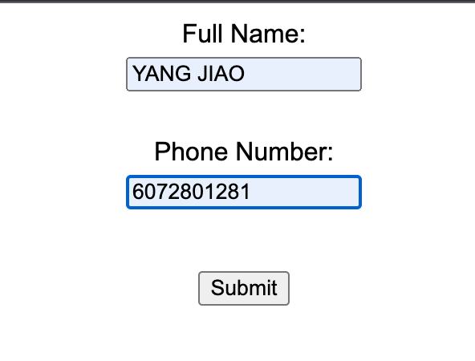
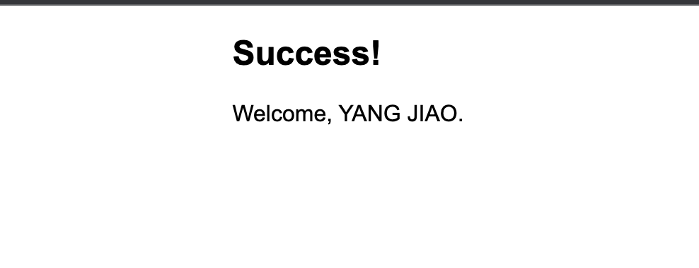
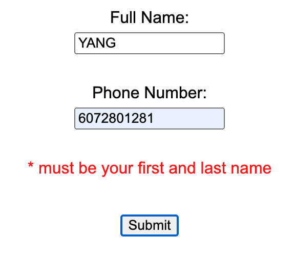
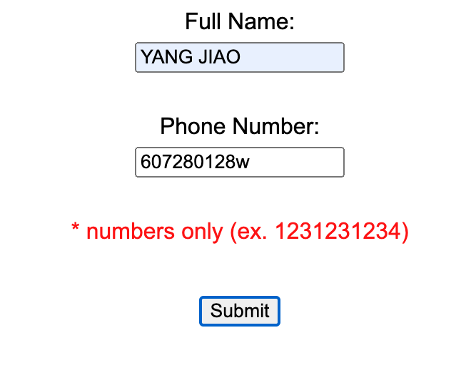
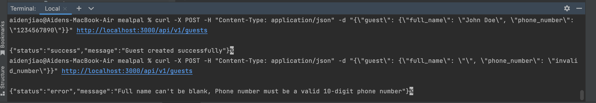

# First Question Result

1. If entered all correct:

	
	
	


2. If entered name wrong:

	

3. If Phone Number wrong:

	

# Second Question Result

1. For valid result test command:

```Curl
curl -X POST -H "Content-Type: application/json" -d "{\"guest\": {\"full_name\": \"John Doe\", \"phone_number\": \"1234567890\"}}" http://localhost:3000/api/v1/guests
```

2. For invalid test command:

```Curl
curl -X POST -H "Content-Type: application/json" -d "{\"guest\": {\"full_name\": \"\", \"phone_number\": \"invalid_number\"}}" http://localhost:3000/api/v1/guests
```

3. Result shown in the below screenshot:

