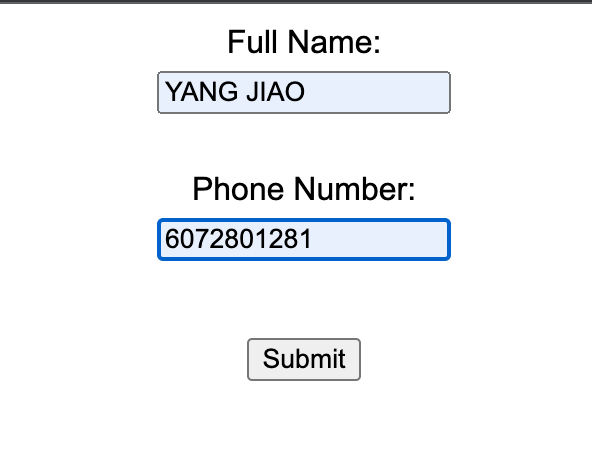
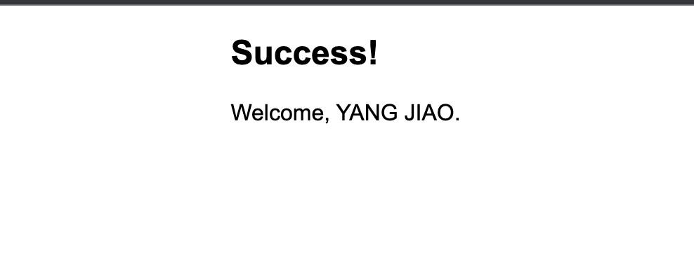
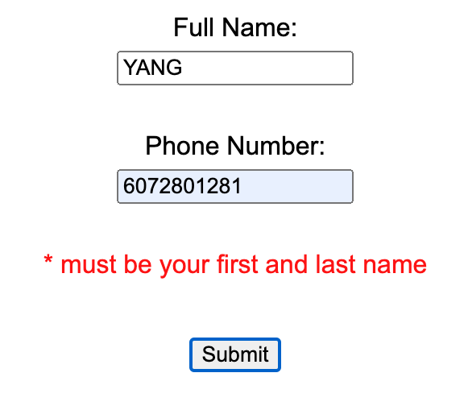
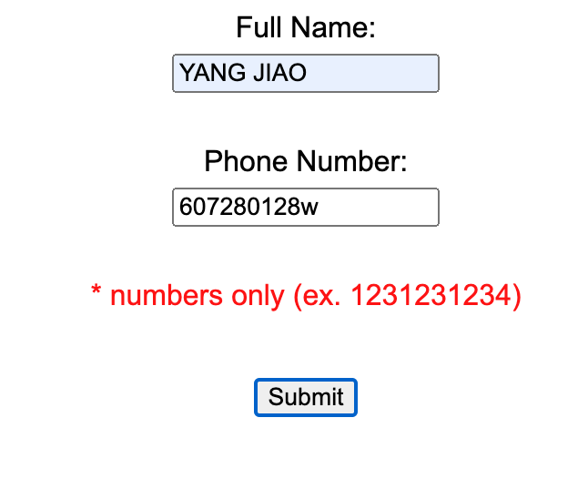

# MPTest Code

1 -  Built a component in React to submit full name and phone number with the acceptance criteria below:

- If a user enters a full name (min. two words) and a valid phone number (10 or 11 digits), they should see the success screen with their name.
- If a user enters a name that has less than two words, they should see an error message (* must be your first and last name)
- If a user enters a phone number that is invalid, they should see an error message (* numbers only (ex. 1231231234))

2 - Created the API endpoint in Rails to receive the data and validate entry before storing it

- If a user submits a valid entry, the API should return a 201 OK response and store the user data in the DB
- If a user submits an invalid entry, the API should return a 400 response and not store the user data in the DB

## First Question Result

1. If entered all correct:

	
	
	


2. If entered name wrong:

	

3. If Phone Number wrong:

	

## Second Question Result

1. For valid result test command:

```Curl
curl -X POST -H "Content-Type: application/json" -d "{\"guest\": {\"full_name\": \"John Doe\", \"phone_number\": \"1234567890\"}}" http://localhost:3000/api/v1/guests
```

2. For invalid test command:

```Curl
curl -X POST -H "Content-Type: application/json" -d "{\"guest\": {\"full_name\": \"\", \"phone_number\": \"invalid_number\"}}" http://localhost:3000/api/v1/guests
```

3. Result shown in the below screenshot:

